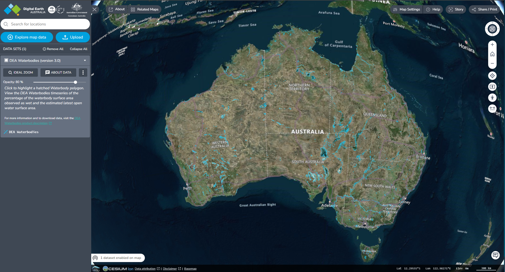
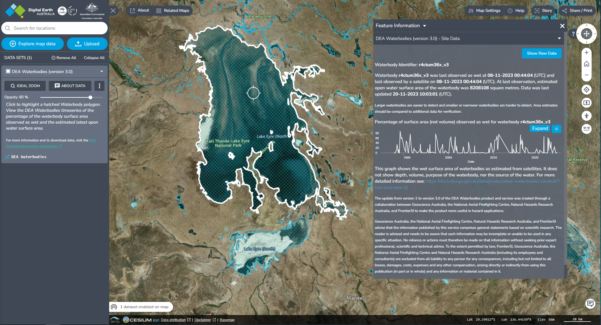

% ## Access constraints

% ## Use constraints

:::{dropdown} How to view the data in a web map

To explore DEA Waterbodies on the interactive DEA Maps platform, visit the link below:

[https://maps.dea.ga.gov.au/#share=s-4RjD9N7swBCZSkXRJJBxOLzVZyK](https://maps.dea.ga.gov.au/#share=s-4RjD9N7swBCZSkXRJJBxOLzVZyK)

and dismiss the overlay. DEA Waterbodies will already be loaded on the map.

To add DEA Waterbodies to DEA Maps manually:

1) Visit [DEA Maps](https://maps.dea.ga.gov.au).

2) Click `Explore map data`.

3) Select `Inland water` > `DEA Waterbodies` > `DEA Waterbodies (version 3.0)`. 

4) Click `Add to the map`, or the `+` symbol to add the data to the map.
:::

:::{dropdown} Is there a DEA Waterbodies User Guide?

Yes!

See [Waterbodies user guide](https://www.dea.ga.gov.au/products/dea-waterbodies/user-guide) to discover how to get the most out of the DEA Maps presentation of DEA Waterbodies including how to explore time series, and how to download the data from a particular time series.

:::

:::{dropdown} What about if I have more questions?

Check out the [DEA Waterbodies Frequently Asked Questions](./?tab=faqs) guide to see if your questions are answered there. 

If you need more help, contact earth.observation@ga.gov.au. 

:::

