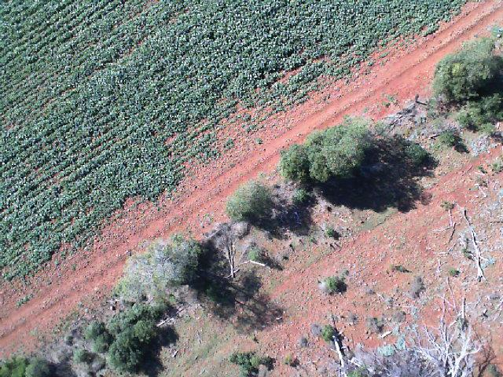

# 2024 Q3: DEA Quarterly Validation Report

:::{contents} In this report
:local:
:backlinks: none
:::

## Executive Summary

This Quarterly report summarises validation for DEA surface reflectance products for Quarter 3 (July-September) of 2024
and presents aggregate validation results to the end of this quarter.

* During this quarter, a total of 9 measurements were taken across 6 field sites, to capture 11 overpasses.
* Validation of Landsat 8 and 9 and Sentinel-2A all improved in accuracy, taking into account the data from this quarter.
* Validation of Sentinel-2B degraded slightly, which is likely because the only site measurement matched to a Sentinel-2B overpass was over a challenging site with complex terrain and surface morphology.
* On an averaged band-by-band basis, Landsat 8 is validated to 2.4%, Landsat 9 is validated to 13.4%, Sentinel-2A is validated to 2.2% and Sentinel-2B is validated to 2.6%.

## Introduction

This quarterly report presents a summary of results from Q3 2024 from the Digital Earth
Calibration and Validation team. The report is presented in the following sections:

* Background &mdash; this section outlines the context around this work, with particular attention paid ton historical work leading up to this quarter.
* Summary of Validation Work &mdash; this section provides an overall view of the field site measurements undertaken.
* Comments on Individual Sites of Interest &mdash; this section focuses on any sites where some aspect of the site or measurement was atypical.
* Summary of Band-by-Band Matching &mdash; this section presents comparison data for this quarter’s results, in the context of all previous results.
* Comments on How This Quarter’s Work Has Affected Combined Validation Results &mdash; this section discusses how the average results for each sensor have changed with the introduction of new validation data this quarter. All band data for each platform is combined to show averaged validation results.

The Q3 2024 validation report includes field site measurements that were captured as part of the winter transect work
across South Australia and New South Wales. Note that one field site measurement for SA1 is part of the Q2 2024
validation report and not shown here. No other field site measurements were conducted during this quarter.
 
## Background

The Digital Earth branch within Geoscience Australia offers a suite of Earth observation products, based on data from
both Landsat and Sentinel platforms. The core products are Landsat 8 and 9 and Sentinel-2A and -2B surface reflectance (SR).
To deliver these products with confidence, the Calibration and Validation (Cal/Val) team perform vicarious validation
by measuring field sites with hand-held equipment or an Unstaffed Aerial Vehicle (UAV; commonly known as drone) equipment
close to the time of an overpass. This work began with Phase 1, where measurements were performed by multiple groups
across continental Australia. Full details on the results and methodology can be found in the Phase 1 report.

Data for both SR products and from field site measurements are made freely available. For SR products, you can visualise
the data in [DEA Maps](https://maps.dea.ga.gov.au/), or for a more in-depth understanding and direct access to data, please visit the [DEA Knowledge Hub Data Products section](https://knowledge.dea.ga.gov.au/data/). Field measurement data are made available through the [National Spectral Database](https://www.ga.gov.au/scientific-topics/dea/dea-data-and-products/national-spectral-database).

As more field sites are measured and as newer measurements are made over the same field sites, the overall validation of
SR products becomes more accurate. The purpose of this report is to provide an up-to-date status of validation accuracy,
based on the most recent measurements.
 
## Summary of Validation Work

6 sites were measured, with 9 individual field site captures. The table below summarises these captures.

:::{csv-table} Summary of field site captures
:header-rows: 1

"Site capture (Date, Field site, Overpasses)","Latitude, Longitude (WGS84)","Instrument","Comments"
"<a href='/validation/site-report/2024-07-01-NSW1/'>2024-07-01 NSW1: L9, S-2B</a>","-31.81348, 142.10368","Hand-held ASD FR-4","Both satellites affected by cloud – validation data not used."
"<a href='/validation/site-report/2024-07-02-NSW2/'>2024-07-02 NSW2: L8</a>","-31.59525, 143.48095","Drone mounted SR-3500","Good matchup"
"<a href='/validation/site-report/2024-07-02-NSW3/'>2024-07-02 NSW3: L8</a>","-31.52124, 145.47855","Hand-held ASD FR-4","Good matchup"
"<a href='/validation/site-report/2024-07-03-NSW3/'>2024-07-03 NSW3: L9, S-2A</a>","-31.52124, 145.47862","Hand-held ASD FR-4","Good matchup"
"<a href='/validation/site-report/2024-07-04-NSW4/'>2024-07-04 NSW4: L8</a>","-31.52760, 146.97750","Drone mounted SR-3500","Good matchup"
"<a href='/validation/site-report/2024-07-04-NSW5/'>2024-07-04 NSW5: L8</a>","-32.20980, 148.21046","Hand-held ASD FR-4","Good matchup"
"<a href='/validation/site-report/2024-07-05-NSW5/'>2024-07-05 NSW5: L9</a>","-32.20982, 148.21043","Hand-held ASD FR-4","Good matchup"
"<a href='/validation/site-report/2024-07-05-NSW6/'>2024-07-05 NSW6: L9, S-2B</a>","-30.78773, 150.02628","Drone mounted SR-3500","Clouds nearby for S-2B overpass but both overpasses show a good matchup. Field site shows a significant slope and is partially over tree canopy."
"<a href='/validation/site-report/2024-07-06-NSW6/'>2024-07-06 NSW6: L8</a>","-30.78777, 150.02628","Drone mounted SR-3500","Good matchup. Field site shows a significant slope and is partially over tree canopy."
:::
 
:::{figure} ./2024Q3_Locations.png

The Figure shows the locations of the field sites measured in this quarter.
::: 

## Comments on Individual Sites of Interest

**NSW6 field site**, also known as Boggabri, is situated on the slope of a hill, which rises about 200m over a length of
around 700m. The bottom of the hill is situated within a canola field, However, the field site is located along the
slope of the hill, which is covered with native vegetation, mainly comprising of trees. This site was specifically
selected to be more challenging than typical field sites due to the slope of the hill and the presence of the tree
canopy.

:::{figure} ./2024Q3-Boggabri1.png

The Figure shows NSW6 field site (blue square), in the context of the surrounding area. The bottom panel of the Figure
shows the elevation profile of the hill, following along the white line drawn in the upper panel.
:::

::::{grid} 1 1 2 3
:::{grid-item}

:::
:::{grid-item}

:::
:::{grid-item}

:::
::::

<figure class="align-default">
    <figcaption>The figure shows three images taken by the drone during flight on 6 July 2024, showing the transition between cultivated field and native area (left) and examples of tree canopy in the field site area (middle and right). This figure highlights the challenges of validating the site, where the surface reflectance properties vary strongly and individual sight lines may land on tree canopy, shadow or somewhere in between.</figcaption>
</figure>
     
## Summary of Band-by-Band Matching

:::{figure} ./2024Q3-Matchup.png

The figure shows comparison data for each platform. Black dots represent data that were collected prior to this quarter.
Coloured symbols represent data that were collected in this quarter. The diagonal line in each panel shows the
one-to-one correspondence between field and satellite data. Note that this diagonal line does NOT show the line of best
fit. It is plotted this way to highlight any trends where the data may be biased away from the line of one-to-one
correspondence. The statistics in the bottom-right corner of each panel provide details for the line of best fit
through all points up to and including this quarter’s data.
:::

The table below lists overall validation results. These are based on the standard deviation of the scatter that we find
for each band of each sensor. This is when taking all the validation results together, up to and including this quarter’s
results. The band-by-band scatter is representative of the validation performance of each band. Rather than providing
values for each individual band, we characterise all results by looking at the mean and maximum scatter for each
platform.

:::{csv-table} Validation Results
:header-rows: 1

"Satellite platform","Mean band-by-band scatter","Maximum band-by-band scatter"
"Landsat 8","2.4%","3.1%"
"Landsat 9","13.4%","35.9%"
"Sentinel-2A","2.2%","2.7%"
"Sentinel-2B","2.6%","4.4%"
:::

For example, the table shows that each Landsat 8 band is typically validated to 2-3%, with the worst performance
of a band being 3.1%. Note that there is much larger scatter for Landsat 9, indicating higher uncertainty in validation.
This is because there have been fewer field site measurements to coincide with the relatively new Landsat 9 platform.

## Effect on Cumulative Validation Results

This section discusses the effect that this quarter’s validation results have had on the total validation
results over all time.

For Landsat 8, this quarter has seen an overall improvement in validation results. There were 5 field site comparison
measurements. The NIR band for NSW6 on 6 July, 2024 stands out as below the line of equality. This is the Boggabri field
site, where there is a significant slope to the site, as well as strongly changing surface reflectance (SR) within the field
site. A BRDF correction to the slope has not yet been applied to the SR-3500 data (expected to be done in Q1, 2025),
which may also contribute to the discrepancy. Overall, the field data for Landsat 8 overpasses continue to improve the
validation reliability, where the statistics indicate that, with all bands taken together, Landsat 8 data can be relied
upon to around 1% of the SR. 

For Landsat 9, this quarter has seen an overall improvement in validation results. There were 4 field site comparison
measurements. Again, the NIR band for NSW6 on 5 July, 2024 stands out as below the line of equality. This is the
Boggabri field site, where there is a significant slope to the site, as well as strongly changing SR
within the field site. A BRDF correction to the slope has not yet been applied to the data, which may also contribute to
the discrepancy. Overall, the field data for Landsat 9 overpasses continue to improve the validation reliability, where
the statistics indicate that, with all bands taken together, Landsat 9 data can be relied upon to around 2% of the
SR. The larger uncertainty of Landsat 9, when compared to Landsat 8 above, is most likely due to few
overall field site comparisons with the newer Landsat 9 OLI2 sensor.

For Sentinel-2A, this quarter has seen an overall improvement in validation results. There was 1 field site comparison
measurement at NSW3 on 3 July, 2024. This measurement shows an excellent match. Overall, the field data for Sentinel-2A
overpasses continue to improve the validation reliability, where the statistics indicate that, with all bands taken
together, Sentinel-2A data are consistently within around 1% of the SR. 

For Sentinel-2B, this quarter has seen an overall degradation in validation results. There was 1 field site comparison
measurement at NSW6 on 5 July, 2024. This measurement is the Boggabri field site, where there is a significant slope to
the site, as well as strongly changing SR within the field site. A BRDF correction to the slope has not
yet been applied to the data, which may also contribute to the discrepancy. Overall, the field data for Sentinel-2B in
this quarter has slightly degraded validation performance, where the statistics indicate that, with all bands taken
together, Sentinel-2B data can be relied upon to around 1% of the SR. 

 
## Acknowledgments
 
The field validation data were collected by Geoscience Australia. 

